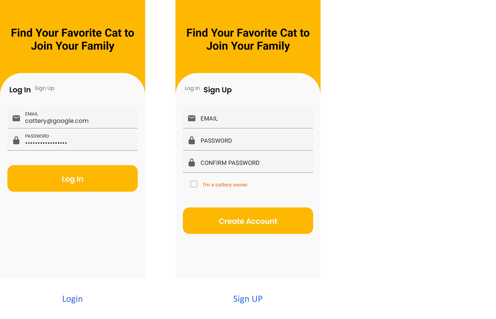
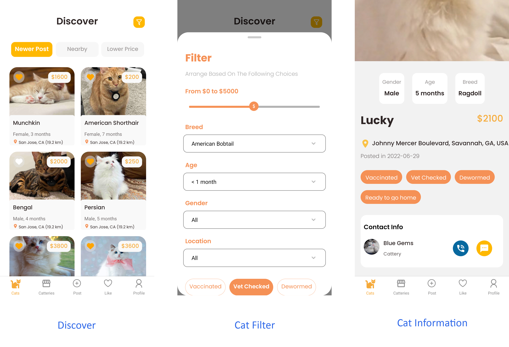
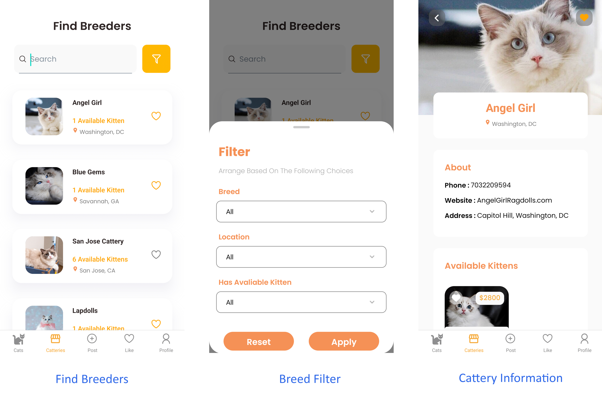
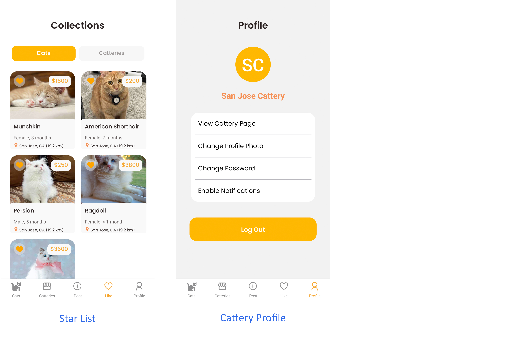
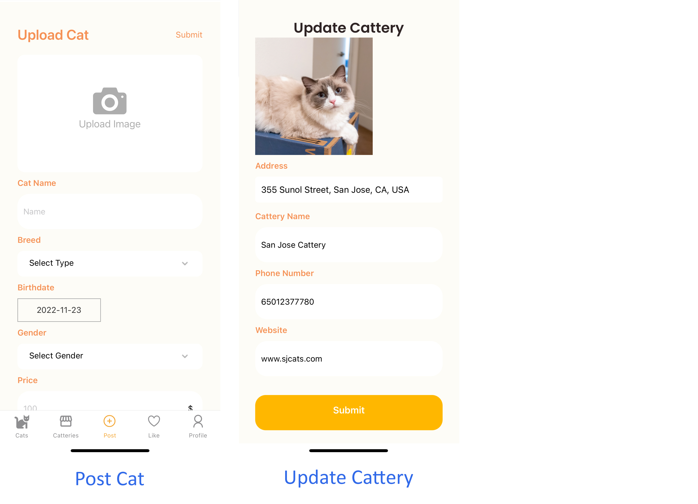

## Begin to use

1. **Set the environment**: Download the whole file pack. Create a `.env` file in the root folder, and add the following environment variables to this file:

   ```
   REACT_APP_FIREBASE_API_KEY=
   REACT_APP_FIREBASE_AUTH_DOMAIN=
   REACT_APP_FIREBASE_PROJECT_ID=
   REACT_APP_FIREBASE_STORAGE_BUCKET=
   REACT_APP_FIREBASE_MESSAGING_SENDER_ID=
   REACT_APP_FIREBASE_APP_ID=
   REACT_APP_FIREBASE_MEASUREMENT_ID=

   REACT_APP_GOOGLE_MAP_APP_KEY=
   ```

2. **Installation**: Open the terminal in your IDE, and then enter `npm install` to the terminal.
3. **Load the App**: After installation, type `npx expo r` and press enter in the terminal. Now the App is ready to use!
4. **Reload the App**: If there is any loading issue, type `r` and press enter in the terminal to reload the App.
5. Due to some latent bugs, the App can somentimes be choking, especially for the filter component. This issue will be solved in the next iteration.
6. **Testing accounts**: For better experience, you can use our pre-prepared testing accounts, as follows.

   ```
   Buyer account:
      Email: buyer@admin.com
      Password: 123456

   Cattery account:
      Email: cattery@admin.com
      Password: 123456
   ```

   Feel free to sign up for your own accounts!

## Iteration 2

### Contributions

**Group members**:
Cuichan Wu, Yuyan Lei, Zhongyi Lu.

**Cuichan Wu**:

1. Implemented and redesigned heart buttons for cat-information screen and find-breeder screen.
2. Implemented cattery card in cat-information screen to get real time cattery name.
3. Redesigned go back button style and icon.
4. Implemented cat-information screen by adding cat details.
5. Redesigned cat chip in post-new-cat screen and cat-information screen.
6. Redesigned style for some screens.
7. Adjusted datePicker color for iOS users.
8. Unified font style on all screens.
9. Added chips and enabled users to filter cats on discover-cat screen.
10. Added cattery photo in cat-information cattery contact section.
11. Implemented simple notification.
12. Enabled users to make a phone call when press the phone button on cat-information screen and phone number on cattery profile.
13. Enabled users to send a message directly through Message when press message button on cat-information screen.

**Yuyan Lei**:

1. Implemented verification and error alerts on the login & signup page.
2. Added the password confirmation to the signup page.
3. Enabled users to star a cattery and displayed the realtime collection list.
4. Enabled users to take a photo with the camera and post it as a kitten photo.
5. Built an edit-posted-cat screen, and enabled users to edit or remove a posted cat.
6. Built a new update-password screen, and enabled users to update their passwords.
7. Implemented the distance calculation and added the distance display to the cat card component.
8. Implemented different input verifications to all input places.
9. Build a heart button component and an edit button component, which are specially for cat-info page and cattery-profile page.
10. Unified the text, button, container and component styles on different screens.
11. Redesigned and rewrote some screens.
12. Rearranged some components to isolated files.
13. Fixed some bugs.

**Zhongyi Lu**:

- Feat:
   1. Changed the behaviors of `Navigation Bar` to always show on screen.
   2. Linked `CatInformation` with firebase database to show real data.
   3. Linked `SearchBar` to firebase database with searching.
   4. Selected and Added a new `DataPicker` to `PostCat` screen.
   5. Replaced onSnapShot in `DiscoverMain`, `FindBreeder`, and `LikeList` with an on-demand data refreshing strategies. Added a global trigger for `LikeList` reloading.
   6. Added swipe gestures for `LikeList`.
- Fix:
  1.  Some buttons do not avoid multiple clicks.
  2.  Going back in `CatInformation` leads to the wrong page.
  3.  Filters take effect before applying.
  4.  Some dates do not work correctly in `DataPicker` in iOS.
  5.  Left slides in `HomePage` leads to `LoginPage`.
- Style:
   1. Grouped inline styles to `StyleSheet`.
   2. Fixed unexpected padding in `LikeList`.
- Test:
   1. Tested all pages.
   2. Reviewed and tested 10 pull requests from group members.

### Features and bugs remaining to resolve in the next iteration

**Features to expect**:

1. Implement the display-nearby-cats feature on the DiscoverCat screen.
2. Implement the map feature for the discoverCat screen.
3. Implement the filter feature for both discoverCat screen and findBreeder screen.
4. Enable users to receive notifications when a nearby cat is posted.
5. Enable users to change their profile photos.
6. Implement automatic line breaks or omissions for text display.
7. Unify the stylesheets and colors.

**Bugs**:

1. Long loading time for distance display.
2. Long loading time when posting a new cat.

## Iteration 1

### Contributions

**Cuichan Wu**:

1. Designed and implemented the CatInfomation screen.
2. Designed and implemented the discover-cat filter.
3. Implemented SliderBar component for the price column, and RBSheet for the filter feature.
4. Designed and implemented the find-breeder filter. (Use the RBSheet for the filter feature)
5. Spent time finding appropriate sliding components for CatInformation screen and optimized interaction.
6. Designed and established the StarList screen.
7. Designed the UserProfile screen.
8. Implemented PhoneButton and MessageButtons.
9. Designed Colors file for general propose.
10. Tested and fixed bugs in the user interface.
11. Tested styling for iOS devices.

**Yuyan Lei**:

1. Designed and refined app user interface by Figma as a significant reference for the overall coding process.
2. Designed the database structure, and implemented the firebase CRUD.
3. Built the navigation bar, and enabled it to display different menus to buyers/cattery owners.
4. Built the login&signup screen, and implemented the authentication & registration feature.
5. Built the post screen, and implemented the post-new-cat feature.
6. Implemented the star-a-cat feature.
7. Built the profile screen, displayed an extra cattery-profile-page button for cattery owners, and implemented the logout feature.
8. Built the cattery profile screen, and implemented the real-time display of profile information and available cats.
9. Built the UpdateCattery screen, and implemented the update-cattery-info feature.
10. Implemented the real-time display on the cat card component.
11. Implemented the real-time display on the cattery card component.
12. Refined the layouts of the CatCard component, FindBreeders screen, and two filter components.
13. Rewrote font loading functions.
14. Finished most of the parts of the README files.

**Zhongyi Lu**:

1. Established firebase database for app and basic CURD functions.
2. Implemented the navigation bar and locate bugs causing navigation lagging.
3. Built Sorting Buttons for the DiscoverMain screen and FindBreederMain screen.
4. Implemented CatCard and BreederCard.
5. Built TextInput Box for general use.
6. Implemented HeartButton and ReturnButton.
7. Built DiscoverMain screen for displaying cat information.
8. Built FindBreederMain screen for showing cattery information.
9. Built CatteryProfile screen for showing detailed information.
10. Implemented font loading for adding custom font.
11. Maintained Firebase database for app storage.
12. Tested and designed styling for Android devices.
13. Tested and fixed bugs in the user interface.

### Features, bugs, and styling issues remaining to resolve in the next iteration

**Features to expect**:

1. Input verifications in each of the input forms.
2. Implement the display-nearby-cats feature on the DiscoverCat screen.
3. Implement the map feature for the discoverCat screen.
4. Implement the filter feature for both discoverCat screen and findBreeder screen.
5. Enable users to star a cattery.
6. Display the realtime cattery collection list.
7. Display th realtime cat infomation on the CatInfo screen.
8. Enable users to change their profile photos and passwords
9. Enable users to receive notifications when a nearby cat is posted.

**Known Bugs**

1. Overloading issues in some screens and two filters.
2. When posting a new cat, the cat ID does not sutomatically assgined to the cattery ID.

**Styling issues**:

1. Require to unify all fonts and font sizes.
2. Require to unify style sheets.
3. Require to unify colors.

### ScreenShots For Iteratio 1











## Project Descriptions

**Find your favorite cat to join your family!**

FindMeow is an app designed for pet lovers to select and buy your favorite cats online without leaving home to start a life with pets! With online functions such as searching or filtering for available kittens, browsing and star favorite catteries, and viewing nearby available kittens or catteries, the app is a convenient platform for catteries to share information and for pet lovers to buy dream cats.

**Convenient and lightweight pet trading portal**

Anytime, anywhere, you can view nearby pet trading information and shopping offers. Buying a cat is super easy!

**Coverage**

Dozens of pet breeds in our app are sold. Pick up your favorite one!

**Pet community**

You can obtain knowledge about pets and share your stories with your loved cats at any time.

**Seller certification**

All pet sellers in our app are certified! Don’t worry about choosing a credible seller.

### Goals

In short, the application helps cat purchasers find and buy their favorite cats more easily and conveniently, and it helps cattery owners sell cats faster.

Specifically, in the United States, there are mainly three niches for the cat-trading market: unpaid or low cost adoptions, private sellers selling personally bred ones, and catteries selling high quality cats.

Our app is focused on the third niche market, which is the transaction of high quality cats from registered catteries. This market accounts for a large share of the U.S. cat transactions, but this market has never been looked at.

Catteries are used to setting up their own web pages, uploading the information about available cats by themselves(often the information is not up to date), and relying on untimely emails to communicate with buyers. Accordingly, such buyers still have to search for information about the cats they want on countless catteries' untimely updated websites.

The advent of our app will revolutionize their transactions, transforming an antiquated, complex, time-consuming, and delayed transaction process into a new, simple, and convenient real-time one.

### Advantages Over Competitors

Although there are many pet buying apps on the market, they share two major characteristics:

One is that they tend to encompass all types of pets. Although that choice makes these apps available to a broader audience, they are often hard to be perfect in either category.

Second, their main sellers tend to be rescue centers or private sellers. Rescue centers allow buyers to adopt cats for free or at a low cost, which is a great way to rescue animals. However, It is rather difficult for buyers who are interested in high quality cats to find their dream cats there. Cats sold by private sellers are at relatively low price, but private sellers do not have related qualifications to breed cats, nor do they have the knowledge and ability to scientifically breed and feed kittens. Therefore the breeding process may be unhealthy and the quality of cats often varies greatly.

Therefore, we choose to go for a platform that specializes in one category and focuses only on cattery transactions.

A dedicated category will allow us to work deeply in the cat buying area, improve the cat buying experience as much as possible, and also establish a brand in a single area faster. Focusing on cattery trading ensures that all cats on the platform are from scientific breeding and healthy feeding, having undergone a complete cat socialization process, and with beautiful looks and excellent pedigrees. All buyers who favor high quality cats can find the most suitable cats for them here.

Besides, our team want to turn the complex process, buying and selling cats, into a simple one. Therefore, we make our app a lightweight one with beautiful user interfaces and provide a charge-free platform to connect merchants and pet lovers. We did not choose to build a profit-oriented and complex application, carrying lots of additional features such as a pet supply mall, a pet community, or a pet dairy, but rather as a pure information-gathering and trading platform. We believe that this design will make our app a lightweight and elegant app.
