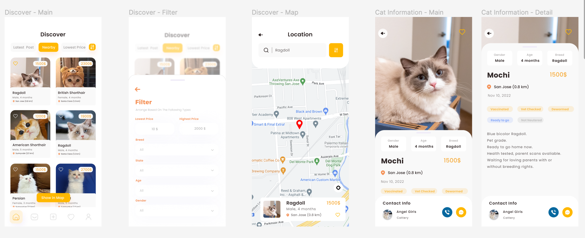
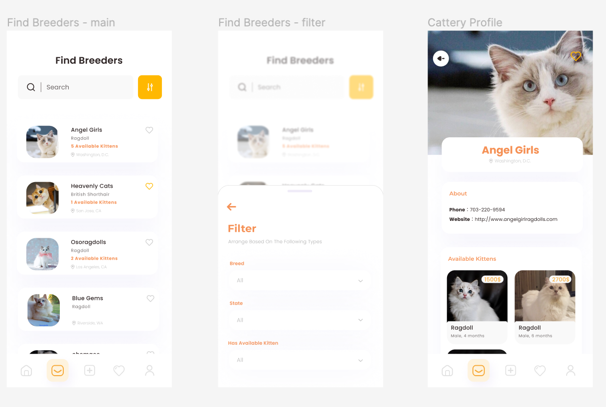
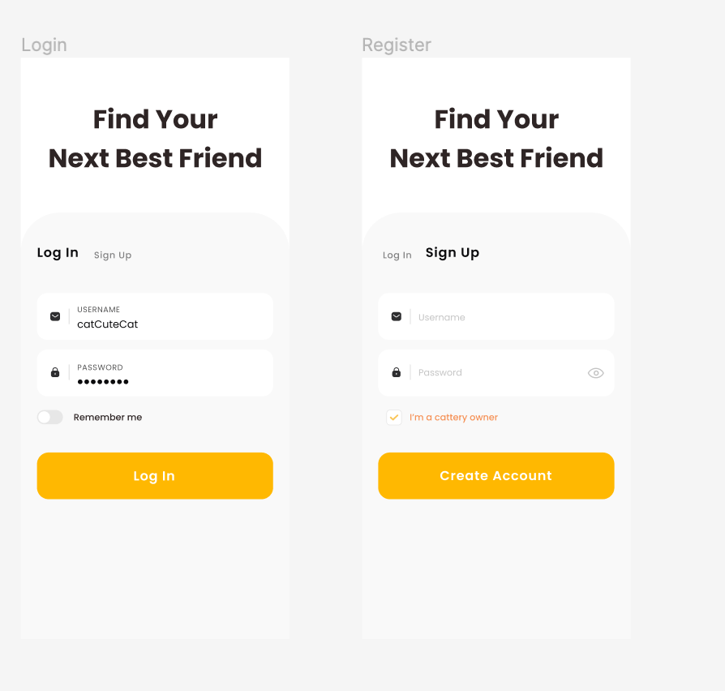

## Description
**Find your favorite cat to join your family!**

FindMeow is an app designed for pet lovers to select and buy your favorite cats online without leaving home to start a life with pets! With online functions such as searching or filtering for available kittens, browsing and star favorite catteries, and viewing nearby available kittens or catteries, the app is a convenient platform for catteries to share information and for pet lovers to buy dream cats.
 

**Convenient and lightweight pet trading portal**

 Anytime, anywhere, you can view nearby pet trading information and shopping offers. Buying a cat is super easy!
 
**Coverage**

 Dozens of pet breeds in our app are sold. Pick up your favorite one!
 
**Pet community**

 You can obtain knowledge about pets and share your stories with your loved cats at any time.
 
**Seller certification**

 All pet sellers in our app are certified! Don’t worry about choosing a credible seller.
 

## UI Design
Designed with Figma.

See high-fidelity prototype at https://www.figma.com/file/05dpdLKL5MVPJbbfeNqn0m/Find-Meow?node-id=0%3A1.

## Aims
In short, the application helps cat purchasers find and buy their favorite cats more easily and conveniently, and it helps cattery owners sell cats faster.

Specifically, in the United States, there are mainly three niches for the cat-trading market: unpaid or low cost adoptions, private sellers selling personally bred ones, and catteries selling high quality cats.

Our app is focused on the third niche market, which is the transaction of high quality cats from registered catteries. This market accounts for a large share of the U.S. cat transactions, but this market has never been looked at. 

Catteries are used to setting up their own web pages, uploading the information about available cats by themselves(often the information is not up to date), and relying on untimely emails to communicate with buyers. Accordingly, such buyers still have to search for information about the cats they want on countless catteries' untimely updated websites. 

The advent of our app will revolutionize their transactions, transforming an antiquated, complex, time-consuming, and delayed transaction process into a new, simple, and convenient real-time one.

## Advantages Over Competitors
Although there are many pet buying apps on the market, they share two major characteristics:

One is that they tend to encompass all types of pets. Although that choice makes these apps available to a broader audience, they are often hard to be perfect in either category.

Second, their main sellers tend to be rescue centers or private sellers. Rescue centers allow buyers to adopt cats for free or at a low cost, which is a great way to rescue animals. However, It is rather difficult for buyers who are interested in high quality cats to find their dream cats there. Cats sold by private sellers are at relatively low price, but private sellers do not have related qualifications to breed cats, nor do they have the knowledge and ability to scientifically breed and feed kittens. Therefore the breeding process may be unhealthy and the quality of cats often varies greatly.

Therefore, we choose to go for a platform that specializes in one category and focuses only on cattery transactions.

A dedicated category will allow us to work deeply in the cat buying area, improve the cat buying experience as much as possible, and also establish a brand in a single area faster. Focusing on cattery trading ensures that all cats on the platform are from scientific breeding and healthy feeding, having undergone a complete cat socialization process, and with beautiful looks and excellent pedigrees. All buyers who favor high quality cats can find the most suitable cats for them here.

Besides, our team want to turn the complex process, buying and selling cats, into a simple one. Therefore, we make our app a lightweight one with beautiful user interfaces and provide a charge-free platform to connect merchants and pet lovers. We did not choose to build a profit-oriented and complex application, carrying lots of additional features such as a pet supply mall, a pet community, or a pet dairy, but rather as a pure information-gathering and trading platform. We believe that this design will make our app a lightweight and elegant app. 
